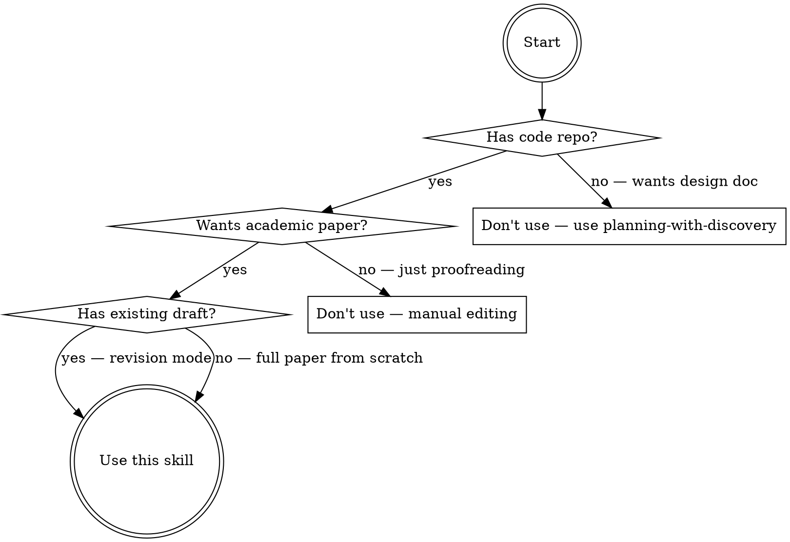

# Academic Paper Forge — Multi-Agent Paper Writing System

A six-phase pipeline that transforms a code repository into a publication-quality academic paper. Specialized agent teams analyze code, debate innovations, plan narrative strategy, and collaboratively write — all governed by a three-powers separation mechanism (Executor-Reviewer-Arbiter) that ensures rigor at every step.

**Core principle:** Every claim in the paper must trace back to code evidence or verified literature. Every agent output is independently reviewed before advancing.

## When to Use



- User wants to write an academic paper based on a code project
- User says "write paper", "论文写作", "学术论文", "paper forge", "generate paper from code"
- User wants code analysis for academic contribution extraction
- User needs structured debate on innovation positioning

**Do NOT use:** Proofreading without code analysis, non-CS papers, papers without a code artifact, simple formatting tasks.

## Quick Reference

| Phase | What | Key Output | Gate |
|-------|------|------------|------|
| 0 | Initialization | Language, format, venue, mode, references, drawing config | — |
| 1 | Code Analysis | `analysis/core-insights.md`, `literature-review.md`, `math-formulation.md`, `code-index.md` | User approves |
| 2 | Analysis Debate | Updated `core-insights.md`, `debate-summary.md` | Consensus or forced arbitration |
| 3 | Writing Plan Debate | `writing-plan/narrative-strategy.md`, `section-outline.md`, `reviewer-strategy.md`, `task-dependency.md` | User approves |
| 4 | Paper Writing | `paper/01-introduction.md` ... `paper/05-conclusion.md` per chapter | Per-phase auto-review + user progress report |
| 5 | Assembly & Output | `paper/full-paper.md`, optional `latex/`, `word/` | User accepts final |

**Output directory:** `{project_root}/paper-output/` — contains `analysis/`, `writing-plan/`, `paper/`, `review-logs/`, and optionally `latex/`, `word/`.

---

## Phase 0: Initialization

Collect all configuration through structured questions. Every subsequent phase reads these settings.

### Step 1: Interaction Language

Use `AskUserQuestion`:
- **question**: "What language for interaction during this session? / 本次交互使用哪种语言？"
- **options**:
  1. "中文（推荐）"
  2. "English"
  3. "中英混合 / Mixed"
  4. "日本語"

Store as `config.interaction_lang`. All agent prompts and user-facing output follow this choice.

### Step 2: Paper Output Language

Use `AskUserQuestion`:
- **question**: "What language for the paper itself? / 论文的最终输出语言？"
- **options**:
  1. "English (recommended for international venues)"
  2. "中文"
  3. "中英双语版本 / Bilingual"
  4. "Same as interaction language"

Store as `config.paper_lang`.

### Step 3: Output Format

Use `AskUserQuestion`:
- **question**: "Paper output format? / 论文输出格式？"
- **options**:
  1. "Markdown (recommended, convertible later)"
  2. "LaTeX (generate .tex files directly)"
  3. "Markdown + LaTeX dual version"
  4. "Word (.docx)"

Store as `config.output_format`.

### Step 4: Target Venue

Use `AskUserQuestion`:
- **question**: "Target venue for submission? / 目标投稿会议/期刊？"
- **options**:
  1. "NeurIPS / ICML / ICLR (ML top-3)"
  2. "CVPR / ECCV / ICCV (Computer Vision)"
  3. "ACL / EMNLP / NAACL (NLP)"
  4. "AAAI / IJCAI (General AI)"

Store as `config.target_venue`. The tool-provided "Other" option allows users to specify KDD, WWW, SIGMOD, journals, etc.

### Step 5: Writing Mode

Use `AskUserQuestion`:
- **question**: "Writing scope? / 本次写作的范围？"
- **options**:
  1. "Full paper: code analysis through complete paper"
  2. "Single chapter: write specific section(s) only"
  3. "Revision mode: improve an existing draft"
  4. "Analysis only: code analysis without paper writing"

Store as `config.writing_mode`.

**If single chapter mode:** follow up with `AskUserQuestion` asking which sections (Abstract, Introduction, Related Work, Methodology — "Other" covers Experiments, Conclusion, etc.).

**If revision mode:** ask user to provide the path to the existing draft.

### Step 6: Reference Sources

Use `AskUserQuestion`:
- **question**: "Do you have reference papers? / 是否有自己的参考文献？"
- **options**:
  1. "No, rely entirely on web search"
  2. "Yes, I will provide a directory path"
  3. "Some core references, supplement with web search"
  4. "I will manually input a reference list"

Store as `config.references`. If user provides a path, validate it exists using `Glob`. If user chooses manual input, collect entries via follow-up.

### Step 7: Drawing Integration

Use `AskUserQuestion`:
- **question**: "Use AI-assisted figure generation? / 是否需要 AI 辅助生成论文图表？"
- **options**:
  1. "Yes, use nano-banana-draw for figures"
  2. "No, I will prepare figures myself"
  3. "Architecture diagrams only, I handle experiment plots"
  4. "Decide later during writing phase"

Store as `config.use_drawing`.

### Step 8: Project Access (Automatic)

No user question required. Execute automatically:

1. Use `Glob` to check for `{project_path}/.claude-index/index.md`
   - **Exists**: Read it for project structure context
   - **Missing**: Suggest running `/project-indexer` first. Ask via `AskUserQuestion`:
     - "Generate project index first? (Recommended)"
     - "Skip, proceed without index"
     - "I will provide project overview manually"
     - "Scan only specific directories"
2. Read `{project_path}/CLAUDE.md` if it exists
3. If the project has many modules, ask analysis scope:
   - "Entire project"
   - "Specific core modules/directories"
   - "Let agents auto-detect key areas"
   - "I will specify files to focus on"

Store as `config.analysis_scope`.

---

## Phase 1: Code Analysis

Dynamic team assembly and parallel deep analysis of the code repository. Produces four structured analysis files.

### 1.1: Assemble Analysis Team

After reading the project index, determine team size based on project complexity:

| Indicator | Small (2-3 agents) | Medium (3-4 agents) | Large (5 agents) |
|-----------|----------------------|----------------------|-------------------|
| Core source files | < 20 | 20-100 | > 100 |
| Module count | < 3 | 3-8 | > 8 |
| Algorithm types | Single | 2-3 | > 3 |

**Core roles (always present):**

| Role | Code Name | Focus |
|------|-----------|-------|
| Architecture Analyst | `arch-analyst` | Module structure, data flow, design patterns, system-level innovation |
| Algorithm Analyst | `algo-analyst` | Core algorithms, model architecture, training strategy, loss functions |
| Innovation Extractor | `innovation-extractor` | Novelty assessment, contribution distillation, differentiation from prior work |

**Extended roles (activated by complexity):**

| Role | Code Name | Trigger | Focus |
|------|-----------|---------|-------|
| Math Modeler | `math-modeler` | Complex algorithms/models | Formal problem definition, objective derivation, pseudocode, complexity analysis |
| Literature Comparator | `lit-comparator` | User chose web search for references | SOTA comparison, related work retrieval via `WebSearch` |

### 1.2: Launch Analysis Agents

Spawn each agent using the `Agent` tool with `run_in_background: true`. Each agent prompt is assembled from these modules (see [team-profiles.md](references/team-profiles.md) for full templates):

1. **Common prefix:** Google Brain/DeepMind senior researcher persona, `config.interaction_lang`, `config.paper_lang`, `config.target_venue`
2. **Rigor constraints:** $1000 penalty for inaccuracy, every claim cites file path + line number, `[UNCERTAIN]` tags mandatory for uncertain conclusions, no fabrication
3. **Three-powers injection:** Executor role awareness (output will be reviewed, disclose uncertainties proactively)
4. **Role specialization:** From [team-profiles.md](references/team-profiles.md) per agent role
5. **Mandatory reading list:** `.claude-index/index.md`, `CLAUDE.md`, role-relevant source files — prefixed with "BEFORE any analysis, read ALL of these files:"
6. **Task assignment + output template + completion criteria:** Report files read, 3-5 sentence summary, `[UNCERTAIN]` items, files created

All analysis agents launch in parallel. Wait for all to complete before proceeding.

### 1.3: Three-Powers Review of Analysis

Apply the three-powers mechanism (see [three-powers-guide.md](references/three-powers-guide.md)) with rotation:

| Task | Executor | Reviewer | Arbiter |
|------|----------|----------|---------|
| Architecture analysis | arch-analyst | algo-analyst | innovation-extractor |
| Algorithm analysis | algo-analyst | innovation-extractor | arch-analyst |
| Innovation extraction | innovation-extractor | arch-analyst | algo-analyst |
| Math modeling | math-modeler | algo-analyst | arch-analyst |
| Literature comparison | lit-comparator | innovation-extractor | algo-analyst |

For each analysis report, auto-spawn a review agent. If the reviewer finds issues, the executor revises. If disagreement persists after two review rounds, the arbiter makes a final ruling. See the Three Powers Mechanism section below for the full workflow.

### 1.4: Analysis Outputs

After review, consolidate into four files under `paper-output/analysis/`:

| File | Content |
|------|---------|
| `core-insights.md` | Project overview, core methods with code locations, ranked innovation points, contribution summary |
| `literature-review.md` | Related research areas, key references table (paper, year, venue, method, relation), SOTA comparison matrix, differentiation analysis |
| `math-formulation.md` | Formal problem definition, core method equations, algorithm pseudocode, theoretical analysis (if applicable) |
| `code-index.md` | Method-to-code mapping table (method, file, line range, description), file importance ranking |

Present analysis summary to user. Use `AskUserQuestion`:
- "Approve and proceed to debate phase"
- "Request deeper analysis on specific areas"
- "Adjust innovation point rankings"
- "Redo analysis with different scope"

---

## Phase 2: Analysis Debate

Structured multi-round debate among analysis team members to reach consensus on core innovations and positioning. See [debate-guide.md](references/debate-guide.md) for the full protocol.

### 2.1: Debate Setup

**Participants:** All analysis team members from Phase 1.
**Topics:**
1. What are the true core innovations? (Rank and filter)
2. Which technical contributions deserve emphasis in the paper?
3. How should the project be positioned relative to SOTA?
4. Is the mathematical formalization accurate and complete?

### 2.2: Debate Execution (Max 3 Rounds)

Each round follows this structure:

**Round N — Position Submission (parallel):**
Spawn each participant as a background agent. Each submits a position document:
- Core judgment on the debate topics
- Supporting evidence (code references, literature)
- Proposed ranking/strategy
- Anticipated counterarguments

**Round N — Cross-Examination (parallel):**
Each agent reviews all other position documents and submits challenges:
- Specific points of disagreement with evidence
- Requests for additional evidence

**Round N — Response and Revision:**
Each agent responds to challenges and may revise their position.

**Round N — Convergence Check:**
The designated arbiter (rotating per round) evaluates consensus:
- **Converged** (>80% agreement on core points): End debate, produce consensus
- **Not converged** + rounds remaining: Proceed to next round
- **Round 3 reached without convergence**: Arbiter issues forced ruling on all disputed points. Ruling is final and binding.

### 2.3: Debate Outputs

- Update `analysis/core-insights.md` to the consensus version
- Generate `analysis/debate-summary.md`: round count, participants, key disagreements with resolutions, final ranked innovations, unified contribution positioning, agreed SOTA differentiation narrative

---

## Phase 3: Writing Plan Debate

A new team debates the paper's narrative strategy, reviewer defense, and section structure.

### 3.1: Assemble Planning Team

Spawn 3 new agents (distinct from the analysis team) set as Google LLM/AI research experts. Each reads ALL Phase 1-2 outputs before participating.

### 3.2: Debate Execution (Max 3 Rounds)

Same debate protocol as Phase 2. Each participant submits a complete writing proposal:
- Paper title suggestion
- Narrative arc (one paragraph: problem motivation through conclusion)
- Per-section core arguments (Introduction, Related Work, Methodology, Experiments, Conclusion)
- Strategy to convince reviewers
- Anticipated reviewer objections with preemptive responses (table: objection, response, paper location)

Cross-examination focuses on: narrative weaknesses, unconvincing arguments, missing experiments, reviewer blind spots.

Convergence and forced arbitration follow the same rules as Phase 2.

### 3.3: Writing Plan Outputs

Generate four files under `paper-output/writing-plan/`:

| File | Content |
|------|---------|
| `narrative-strategy.md` | Consensus narrative arc, per-section core arguments, paper title |
| `section-outline.md` | Detailed outline with subsection structure, key points per subsection, target word counts |
| `reviewer-strategy.md` | Reviewer objection table, defense strategies, preemptive placements in paper |
| `task-dependency.md` | Writing task dependency graph (Phase A/B/C), per-task assignment, parallel groups |

Present writing plan to user. Use `AskUserQuestion`:
- "Approve and assemble writing team"
- "Adjust narrative strategy"
- "Modify section outline"
- "Return to analysis phase for additional work"

---

## Phase 4: Paper Writing

Assemble a 5-7 person writing team, execute in dependency order (Phase A/B/C), with auto-triggered three-powers review after each chapter.

### 4.1: Writing Team Assembly

**Fixed roles (5 members):**

| # | Role | Code Name | Responsibility | Must-Read Files |
|---|------|-----------|----------------|-----------------|
| 1 | Chief Editor | `chief-editor` | Full-paper consistency, style coordination, Abstract + Conclusion, standing Arbiter | All files |
| 2 | Introduction Writer | `intro-writer` | Introduction, research motivation, contribution list | core-insights.md, narrative-strategy.md, literature-review.md |
| 3 | Method Writer | `method-writer` | Methodology, algorithm description, formula derivation | math-formulation.md, code-index.md, core-insights.md |
| 4 | Experiment Writer | `experiment-writer` | Experiments, results analysis, ablation studies | core-insights.md, literature-review.md, code-index.md |
| 5 | Literature Searcher | `lit-searcher` | Related Work, reference retrieval and organization | literature-review.md, user-provided references |

**Optional roles (0-2 members):**

| # | Role | Code Name | Activation | Responsibility |
|---|------|-----------|------------|----------------|
| 6 | Figure Designer | `figure-designer` | `config.use_drawing` enabled | Architecture diagrams, method figures, experiment plots via nano-banana-draw |
| 7 | Internal Reviewer | `internal-reviewer` | Always active (review role) | Simulates venue reviewer, chapter-level quality audit |

### 4.2: Present Team for Approval

Show the user: team composition, task assignments, dependency graph visualization, estimated chapter count and length.

Use `AskUserQuestion`:
- "Approve and start writing"
- "Adjust team members"
- "Adjust task assignments"
- "Return to modify writing plan"

### 4.3: Dependency Graph Execution

```
Phase A (parallel): [Related Work] [Methodology] [Figures*]
                         |              |             |
Phase B (parallel): [Introduction] [Experiments]
                         |              |
Phase C (parallel): [Abstract]    [Conclusion]
                         |
Final:              [Chief Editor: Full Assembly]
```

*Figures only if figure-designer is activated.

**Phase A — Launch parallel agents:**

Spawn each Phase A writer using the `Agent` tool with `run_in_background: true`. Each agent prompt includes:

1. Team persona from [team-profiles.md](references/team-profiles.md)
2. Role-specific instructions from [writing-style-guide.md](references/writing-style-guide.md)
3. Three-powers role assignment (Executor)
4. Mandatory file reading list (all analysis + writing-plan files)
5. Style constraints (see Writing Quality Rules below)
6. Completion criteria and reporting requirements
7. Section-specific instructions:
   - **lit-searcher**: Use `WebSearch` for latest papers, verify every citation exists, organize by research direction not chronology, bridge from related work to this project's method
   - **method-writer**: Strictly follow `math-formulation.md`, cross-check with `code-index.md`, include algorithm pseudocode, ensure reproducibility from this section alone
   - **figure-designer**: Invoke `nano-banana-draw` skill, unified visual style, minimum Figure 1 = system architecture overview, output to `paper/figures/`

Wait for all Phase A agents to complete. Auto-trigger review for each (see Section 4.4). Only after all Phase A chapters pass review, launch Phase B.

**Phase B — Launch after Phase A reviewed:**

- **intro-writer**: Read completed Related Work and Methodology, follow `narrative-strategy.md`, structure as: concrete problem introduction, existing method limitations, this paper's approach, contribution list (3-4 bullets). Must not duplicate Related Work content.
- **experiment-writer**: Reference Related Work baselines and Methodology components, follow `reviewer-strategy.md` for experiment design, include setup, main comparison, ablation, analysis. Use `[PLACEHOLDER: fill with actual results]` where real data is unavailable.

Wait for Phase B completion and review pass, then launch Phase C.

**Phase C — Launch after Phase B reviewed:**

- **chief-editor writes Abstract**: 150-250 words, every claim must be supported in the body. Based on all completed chapters.
- **chief-editor writes Conclusion**: Summarize contributions, discuss limitations honestly, propose future work. Consistent with all chapters.

### 4.4: Auto-Triggered Chapter Review

When any writer agent completes, **immediately** spawn a review agent — do NOT wait for user input.

**Review agent prompt** includes: senior `{config.target_venue}` Area Chair persona, Three Powers Reviewer injection ($1000 penalty for perfunctory review), mandatory reading (chapter file + section-outline + narrative-strategy + relevant analysis files), and a three-part review checklist:

- **Content quality:** Matches writing plan, clear arguments, technical accuracy vs code-index.md, real citations
- **Writing quality:** No AI traces (see Writing Quality Rules), professional language, paragraph thesis structure, consistent terms
- **Academic standard:** Meets venue standard, innovation adequately argued, sound experiment design

Output follows the review report template from [three-powers-guide.md](references/three-powers-guide.md).

**Review outcomes:**
- **Pass**: Mark chapter as reviewed. If all chapters in current phase pass, launch next phase.
- **Fail**: Reviewer fixes minor issues directly. For major issues, spawn a fix agent with the issue list. Re-review after fix (round 2). If still failing after round 2, the executor may dispute. If disputed, Chief Editor (Arbiter) makes a final binding ruling. If not disputed, one more fix cycle is attempted (round 3 max). After 3 review rounds without pass, Chief Editor forces a final ruling.

**On review failure after arbiter ruling**, use `AskUserQuestion`:
- "Accept Chief Editor's ruling and proceed"
- "Manually review and provide guidance"
- "Reassign chapter to different writer"
- "Skip this chapter for now"

### 4.5: Progress Reporting

After each execution phase completes, report to user:

```
## Phase {X} Writing Progress

| Chapter | Writer | Status | Review | Word Count |
|---------|--------|--------|--------|------------|
| Related Work | lit-searcher | Complete | Passed | ~2,500 |
| Methodology | method-writer | Complete | Passed (round 2) | ~3,200 |

Launching Phase {X+1}...
```

---

## Phase 5: Assembly & Output

### 5.1: Full Paper Assembly

Chief Editor agent merges all chapters into `paper/full-paper.md`:
1. Combine chapters in order: Abstract, Introduction, Related Work, Methodology, Experiments, Conclusion, References
2. Unify terminology, notation, and writing style across chapters
3. Verify cross-references (figure numbers, equation numbers, citation numbers)
4. Generate `paper/references.md` with complete bibliography

### 5.2: Final Review

Spawn an independent final reviewer (Google Research Director persona, distinct from all previous agents). Reviews: logical consistency across chapters, smooth transitions, unified terminology/symbols, sequential reference/figure numbering, AI trace detection, `{config.target_venue}` compliance. Outputs pass/fail with issue list. If issues found, Chief Editor resolves. Max 2 rounds.

### 5.3: Format Conversion

Based on `config.output_format`:

- **Markdown (default):** Already produced. Standards: `$$...$$` block math, `$...$` inline, ``, `[N]` references, fenced pseudocode blocks.
- **LaTeX:** Spawn conversion agent. Generate `latex/main.tex` with venue-specific document class (see [venue-profiles.md](references/venue-profiles.md)), per-chapter `.tex` files in `latex/sections/`, `references.bib`, copied `figures/`, and `Makefile`. Apply standard MD-to-LaTeX conversion rules.
- **Word:** Invoke docx skill to convert from Markdown. Output to `word/paper.docx`.

### 5.4: Final User Options

Use `AskUserQuestion`:
- "Complete — I will take it from here"
- "Run an additional optimization round"
- "Convert to another format"
- "Walk through each chapter for revision feedback"

---

## Three Powers Mechanism

The Executor-Reviewer-Arbiter separation governs ALL multi-agent collaboration steps across Phases 1-5. See [three-powers-guide.md](references/three-powers-guide.md) for the complete protocol.

### Roles

| Role | Responsibility | Constraints |
|------|----------------|-------------|
| **Executor** | Produce the deliverable (analysis, chapter, etc.) | Cannot self-review, cannot mark own work as passed |
| **Reviewer** | Independently audit the executor's output | Cannot modify executor's work directly (except minor fixes), cannot serve as arbiter |
| **Arbiter** | Final ruling when executor and reviewer disagree | Intervenes only on dispute, ruling is final and unappealable |

### Role Assignment Rules

- **Analysis phase (1-2):** Rotating assignment — each agent serves as executor, reviewer, and arbiter across different tasks
- **Writing phase (4):** Chief Editor is the standing Arbiter. Internal Reviewer is the standing Reviewer. Chapter writers are Executors. Reviewer role rotates for variety where possible.
- **Debate phases (2-3):** All participants are simultaneously executors (position submission) and reviewers (cross-examination). A dedicated convergence evaluator serves as arbiter.

### Review Workflow

1. Executor submits output
2. Reviewer independently audits (reads source material, checks evidence)
3. **Pass** → mark complete, proceed. **Fail** → Reviewer lists issues (severity-ranked)
4. Executor revises → Reviewer re-audits
5. **Pass** → mark complete. **Still fails** → if Executor disputes, Arbiter reviews all materials and issues binding ruling. If no dispute, Executor revises again.

### Anti-Deception Measures

1. **Mandatory disclosure:** Executors must mark uncertain items with `[UNCERTAIN]`. Hiding uncertainty is a $1000 penalty offense.
2. **No self-review:** An agent can never review its own output. Enforced by role rotation tables.
3. **Independent judgment:** Reviewers must read source materials independently, not just echo the executor's claims.
4. **Audit trail:** All review reports and arbitration rulings are saved to `review-logs/` with timestamps.
5. **Anti-collusion:** Arbiter does not communicate with executor or reviewer during the review phase. Arbiter only activates upon dispute.

### Prompt Injection

Every agent prompt includes a role-awareness block. Inject the appropriate variant:

- **Executor:** "Your output will be independently reviewed. Disclose uncertainties with `[UNCERTAIN]`. Every factual claim needs evidence (file path + line number, or citation)."
- **Reviewer:** "Assess independently. Check every item on the review checklist — blanket 'pass' without evidence incurs a $1000 penalty. Fix minor issues directly; flag major issues."
- **Arbiter:** "Intervene only on dispute. Ruling is final and unappealable. Review all materials from both parties before deciding."

---

## Writing Quality Rules

Injected into every writing agent's prompt. See [writing-style-guide.md](references/writing-style-guide.md) for the full guide.

### Hard Constraints (Violation = $1000 Penalty)

1. Maximum 1 em dash per paragraph
2. Maximum 2 "however" per page
3. **Forbidden phrases:**
   - "It is worth noting/mentioning that..."
   - "In recent years, X has gained..."
   - "X plays a crucial/important/vital role in..."
   - "To the best of our knowledge..."
   - "The rest of the paper is organized as follows..." (if needed, use a natural phrasing)
4. No sequential "Firstly, Secondly, Thirdly, Finally"
5. Prefer active voice ("We propose X" not "X is proposed")
6. Every paragraph's first sentence must be its thesis statement
7. Define technical terms on first use, then abbreviate
8. No more than 2 consecutive adjectives modifying one noun
9. No exclamation marks
10. Use "use" instead of "leverage" or "utilize"

### Quality Standards

- Every factual claim must have evidence (code reference or citation)
- Mathematical formulas must be verifiable against source code
- All cited papers must actually exist (verify via `WebSearch` if needed)
- Content must be adapted to `config.target_venue` conventions and page limits

---

## Common Mistakes

| Mistake | Fix |
|---------|-----|
| Launching Phase N+1 before Phase N is complete and reviewed | Phase-gated: all agents complete + all reviews pass before next phase |
| Skipping three-powers review to save time | Review is mandatory and auto-triggered. Never skip. |
| Agent writes without reading mandatory files | Every agent prompt starts with "BEFORE any work, read ALL of these files:" |
| AI writing traces in output | Enforce style rules in every writer prompt. Reviewer checklist catches violations. |
| Fabricated citations in Related Work | Literature searcher must verify every citation via WebSearch |
| Self-review (agent reviews own output) | Role rotation tables prevent this. Check assignments before spawning. |
| Waiting for user before auto-review | Chapter review is auto-triggered. Never wait for user input to start review. |
| Debate exceeding 3 rounds | Hard cap at 3 rounds. Round 3 ends with forced arbitration. |
| Not using `Agent` tool for subagents | All multi-agent phases MUST use `Agent` tool, not just describe tasks |
| Launching debate before analysis review passes | Phase 1 outputs must be reviewed before Phase 2 debate begins |
| Starting writing without user approval of writing plan | User must approve team composition in Step 4.2 |
| Figures generated but not referenced in text | Chief Editor checks all figure references during assembly |

---

## Required Tools

- `Read`, `Write`, `Edit` — file operations for analysis outputs, paper chapters, review logs
- `Glob`, `Grep` — project code exploration, file discovery
- `Bash` — directory creation (`paper-output/`, subdirectories)
- `AskUserQuestion` — structured choices (4 options, tool adds 5th "Other")
- `WebSearch` — literature retrieval, citation verification
- **`Agent`** — spawning all subagents (analysis, debate, writing, review). Use `run_in_background: true` for parallel agents within the same execution phase.
- `Skill` — invoking `project-indexer` (pre-flight) and `nano-banana-draw` (figure generation)

Phase 0-3 works in any environment. Phase 4-5 requires the `Agent` tool for subagent spawning.

---

## References

- [team-profiles.md](references/team-profiles.md) — Full persona definitions for all agent roles
- [debate-guide.md](references/debate-guide.md) — Structured debate protocol and templates
- [three-powers-guide.md](references/three-powers-guide.md) — Executor-Reviewer-Arbiter mechanism details
- [writing-style-guide.md](references/writing-style-guide.md) — Anti-AI writing rules and style standards
- [output-templates.md](references/output-templates.md) — Templates for all output files
- [venue-profiles.md](references/venue-profiles.md) — Target venue formatting profiles and LaTeX templates
