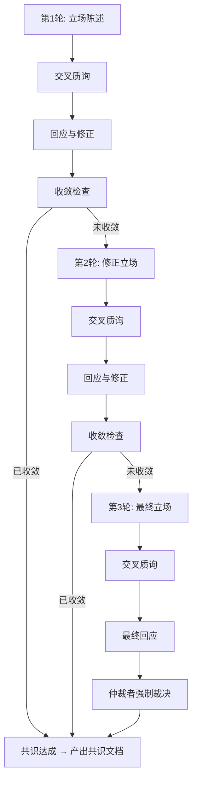

# 结构化辩论机制参考指南

academic-paper-forge 中 Phase 2（分析辩论）和 Phase 3（写作方案辩论）的完整辩论协议。

---

## 辩论总览

### 适用场景

| 场景 | Phase | 参与者 | 辩论目标 |
|------|-------|--------|---------|
| 分析结果辩论 | Phase 2 | 分析团队全员（3-5人） | 核心创新点、方法优势的共识 |
| 写作方案辩论 | Phase 3 | 写作策划团队（新组建） | 论文叙事逻辑、打动审稿人的策略 |

### 辩论流程图



### 核心约束

- 最多 3 轮，第 3 轮结束后强制裁决
- 每轮中所有智能体并行提交立场，不允许先看他人立场再提交
- 仲裁者在第 1、2 轮仅做收敛评估，不参与立场表达
- 第 3 轮仲裁者可强制裁决
- 所有辩论文档使用 `config.interaction_lang` 指定的语言

---

## 第1轮：立场陈述

每个参与智能体独立提交立场文档。所有智能体并行提交，提交后才可看到他人立场。

### 立场文档模板

```markdown
# 立场文档 — {agent_name}

## 辩论主题
{当前辩论的具体议题}

## 核心观点
{对辩论主题的核心判断，用2-3句话精炼表述}

## 论据

### 论据 1: {论据标题}
- **主张**: {具体主张}
- **证据**: {代码引用 / 文献引用 / 数据支撑}
- **推理**: {从证据到主张的推理链}

### 论据 2: {论据标题}
- **主张**: {具体主张}
- **证据**: {代码引用 / 文献引用 / 数据支撑}
- **推理**: {从证据到主张的推理链}

### 论据 3: {论据标题}
- **主张**: {具体主张}
- **证据**: {代码引用 / 文献引用 / 数据支撑}
- **推理**: {从证据到主张的推理链}

## 建议方案
{具体的建议，包括排序、优先级、实施策略}

## 预期反驳
| 可能的反对意见 | 我的预回应 |
|--------------|----------|
| {反对意见1} | {回应1} |
| {反对意见2} | {回应2} |

## 置信度
- 核心观点置信度: {高/中/低}
- 最不确定的部分: {指出哪个论据最薄弱}
```

---

## 交叉质询

每个智能体对其他所有人的立场文档提出质疑。质询必须具体、有建设性，不允许笼统的否定。

### 交叉质询模板

```markdown
# 交叉质询 — {questioner} → {respondent}

## 质疑摘要
{一句话概括对 {respondent} 立场的核心质疑}

## 质疑点

### 质疑 1: {质疑标题}
- **针对**: {respondent} 的 {具体论据/观点}
- **质疑内容**: {详细描述为何该论据不成立或不充分}
- **原因**: {给出你质疑的理由和依据}
- **替代解释**: {如果有，提供你认为更合理的解释}

### 质疑 2: {质疑标题}
- **针对**: {respondent} 的 {具体论据/观点}
- **质疑内容**: {详细描述}
- **原因**: {理由和依据}
- **替代解释**: {如有}

## 需要补充的证据
{要求对方提供什么额外证据来支撑其立场}
- {证据需求1}: {为什么需要这个证据}
- {证据需求2}: {为什么需要这个证据}

## 共识区域
{指出你与 {respondent} 达成一致的部分，如果有的话}
```

---

## 回应与修正

被质询的智能体回应质疑。必须对每个质疑点逐一回应，明确是坚持还是修正。

### 回应与修正模板

```markdown
# 回应 — {respondent}（第{N}轮）

## 对 {questioner_1} 的回应

### 关于质疑 1: {质疑标题}
- **决定**: 坚持 / 修正 / 部分接受
- **回应**: {详细回应内容}
- **补充证据**: {如果质询者要求提供额外证据}

### 关于质疑 2: {质疑标题}
- **决定**: 坚持 / 修正 / 部分接受
- **回应**: {详细回应内容}

## 对 {questioner_2} 的回应

### 关于质疑 1: {质疑标题}
- **决定**: 坚持 / 修正 / 部分接受
- **回应**: {详细回应内容}

## 修正后的立场（如有变化）

### 修正点
| 原始立场 | 修正后 | 修正原因 |
|---------|--------|---------|
| {原始} | {修正} | {原因} |

### 更新的核心观点
{如果核心观点有变化，重新陈述}

### 未改变的核心观点
{明确列出哪些观点经过质询后仍然坚持}
```

---

## 收敛检查

由仲裁者（收敛评估者）在每轮辩论的回应阶段结束后执行。

### 收敛条件（满足任一即可）

1. **高度共识**: 所有参与者在核心观点上达成一致（>80% 重叠）
2. **边缘分歧**: 分歧仅在非关键细节上，不影响后续工作
3. **轮次上限**: 已达到第 3 轮上限（此时强制裁决）

### 收敛评估模板

```markdown
# 收敛评估 — 第{N}轮

## 评估者: {arbiter_name}
## 辩论主题: {topic}
## 参与者: {agent_list}

## 共识区域
| 要点 | 达成共识的立场 | 支持者 |
|------|--------------|--------|
| {要点1} | {共识立场} | {哪些智能体支持} |
| {要点2} | {共识立场} | {哪些智能体支持} |

## 分歧区域
| 分歧点 | 立场 A | 持有者 A | 立场 B | 持有者 B | 严重程度 |
|--------|--------|---------|--------|---------|---------|
| {分歧1} | {立场} | {谁} | {立场} | {谁} | 关键 / 次要 |
| {分歧2} | {立场} | {谁} | {立场} | {谁} | 关键 / 次要 |

## 收敛度量
- 核心观点一致率: {X}%
- 关键分歧数量: {N} 个
- 次要分歧数量: {N} 个

## 判定: 收敛 / 未收敛
## 理由: {详细解释判定依据}

## 下一步
- 如果收敛: 进入共识文档生成
- 如果未收敛: 进入第{N+1}轮，重点讨论以下分歧: {list}
```

---

## 第3轮强制裁决协议

如果 3 轮辩论后仍未完全收敛，仲裁者启动强制裁决程序。

### 裁决流程

1. 仲裁者综合所有 3 轮的立场文档、质询和回应
2. 对每个未解决的分歧点做出最终裁决
3. 裁决不可上诉，所有智能体必须接受
4. 生成最终共识文档

### 强制裁决模板

```markdown
# 强制裁决 — 第3轮仲裁

## 仲裁者: {arbiter_name}
## 辩论主题: {topic}
## 辩论轮次: 3轮（已达上限）

## 裁决前提
经过3轮结构化辩论，以下分歧未能通过讨论解决，现由仲裁者做出最终裁决。

## 逐项裁决

### 分歧 1: {分歧描述}

**立场综述:**
| 智能体 | 立场 | 核心论据 | 论据强度评估 |
|--------|------|---------|-------------|
| {agent_A} | {立场} | {论据} | 强 / 中 / 弱 |
| {agent_B} | {立场} | {论据} | 强 / 中 / 弱 |

**裁决**: {采纳立场 A / 采纳立场 B / 折中方案}
**裁决依据**: {基于证据强度、逻辑完整性和实际可行性的详细分析}
**具体内容**: {裁决的具体内容，足够详细以直接写入共识文档}

### 分歧 2: {分歧描述}

**立场综述:**
| 智能体 | 立场 | 核心论据 | 论据强度评估 |
|--------|------|---------|-------------|
| {agent_A} | {立场} | {论据} | 强 / 中 / 弱 |
| {agent_B} | {立场} | {论据} | 强 / 中 / 弱 |

**裁决**: {采纳立场 A / 采纳立场 B / 折中方案}
**裁决依据**: {详细分析}
**具体内容**: {裁决的具体内容}

## 裁决汇总

| 分歧点 | 裁决结果 | 裁决类型 |
|--------|---------|---------|
| {分歧1} | {结果} | 采纳一方 / 折中 |
| {分歧2} | {结果} | 采纳一方 / 折中 |

## 声明
本裁决为最终裁决，不可上诉。所有参与智能体必须在后续工作中遵循本裁决的结论。
```

---

## Phase 2 分析辩论特化

### 辩论主题

基于 Phase 1 产出的 4 个分析文件（`core-insights.md`、`literature-review.md`、`math-formulation.md`、`code-index.md`），聚焦：

1. **核心创新点排序**: 项目的核心创新点是什么？如何排序？
2. **技术贡献定位**: 最值得在论文中突出的技术贡献是什么？
3. **SOTA 差异定位**: 与 SOTA 的关键差异如何定位？
4. **数学形式化验证**: 数学形式化是否准确完整？

### 参与者

分析团队全员：arch-analyst、algo-analyst、innovation-extractor、math-modeler（如启用）、lit-comparator（如启用）。

### 辩论产出

- 更新 `analysis/core-insights.md`（共识版本）
- 生成 `analysis/debate-summary.md`

### 分析辩论摘要模板

```markdown
# 分析辩论总结

## 辩论轮次: {N}轮
## 参与者: {agent_list}
## 收敛方式: 自然收敛 / 仲裁裁决

## 关键分歧与解决

| 分歧点 | 立场 A | 立场 B | 最终决议 | 决议依据 |
|--------|--------|--------|---------|---------|
| {分歧1} | {立场} | {立场} | {决议} | {依据} |
| {分歧2} | {立场} | {立场} | {决议} | {依据} |

## 最终共识

### 核心创新点（排序后）
1. **{最重要的创新点}** — 新颖度: {高/中}，影响度: {高/中}
   - 简述: {一句话描述}
   - 代码依据: {文件路径}
2. **{第二重要的创新点}** — 新颖度: {高/中}，影响度: {高/中}
   - 简述: {一句话描述}
   - 代码依据: {文件路径}
3. ...

### 论文技术贡献定位
{一段话描述论文的技术贡献如何定位，包括核心 claim 和支撑点}

### 与 SOTA 的差异化描述
{统一的差异化叙事，明确本方法在哪些维度上优于/不同于已有方法}

### 数学形式化共识
{对数学描述的准确性和完整性的共识评估，如有修正需列出}
```

---

## Phase 3 写作方案辩论特化

### 辩论主题

基于 Phase 1-2 的所有产出，聚焦：

1. **叙事逻辑**: 论文的整体叙事逻辑应如何构建？
2. **贡献定位**: 如何在 Introduction 中定位贡献？
3. **实验设计**: 实验应如何设计来最大化说服力？
4. **审稿人预防**: 审稿人最可能质疑什么？如何预防？

### 参与者

新组建的写作策划团队（非分析团队），设定为 Google LLM/AI 方向专家。

### 写作方案提交模板

```markdown
# 写作方案 — {agent_name}

## 论文标题建议
{主标题}: {副标题}

## 叙事主线
{一段话描述论文从头到尾的叙事逻辑：问题是什么 → 为什么难 → 现有方法为什么不够好 → 我们的核心思路 → 关键结果}

## 各章节核心论点

### Introduction
- 核心论点: {一句话}
- 开篇策略: {如何吸引读者注意}
- 贡献列表草案: {3-4 bullet points}

### Related Work
- 定位策略: {如何组织相关工作，凸显本文的差异性}
- 分组方案: {按什么维度分组}

### Methodology
- 呈现策略: {先讲什么后讲什么，如何平衡直觉和严谨}
- 关键图表: {方法部分需要哪些图来帮助理解}

### Experiments
- 实验设计方案: {主实验 + 消融 + 分析的结构}
- 基线选择: {选哪些基线，为什么}
- 关键指标: {用什么指标，为什么}

### Conclusion
- 总结策略: {如何总结而不重复 Introduction}
- Future work 方向: {2-3 个方向}

## 打动审稿人的策略
{具体策略，包括如何让审稿人觉得这篇论文必须 accept}

## 预期审稿人质疑与应对
| 可能质疑 | 严重程度 | 应对策略 | 在论文中的位置 |
|---------|---------|---------|--------------|
| {质疑1} | 高/中/低 | {策略} | {Section X} |
| {质疑2} | 高/中/低 | {策略} | {Section X} |

## 风格建议
{对论文整体写作风格的建议}
```

### 写作方案辩论产出

辩论收敛后生成以下 4 个文件：

1. **`writing-plan/narrative-strategy.md`** — 共识版叙事策略
2. **`writing-plan/section-outline.md`** — 详细章节大纲
3. **`writing-plan/reviewer-strategy.md`** — 审稿人应对策略
4. **`writing-plan/task-dependency.md`** — 写作任务依赖图

---

## 辩论执行注意事项

1. **并行提交**: 每轮所有智能体使用 `run_in_background: true` 并行提交立场，确保独立思考
2. **证据约束**: 所有论据必须有可追溯的证据（代码位置、文献引用、数据指标）
3. **建设性原则**: 质询必须是建设性的，目标是改进共识而非赢得辩论
4. **中间文件**: 每轮的立场文档、质询文档、回应文档作为中间文件保存，最终只输出共识结果
5. **效率优先**: 如果第 1 轮即达成高度共识（>90%），可跳过后续轮次直接生成共识文档
