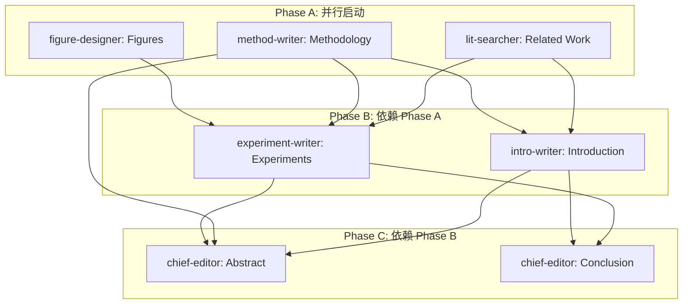

# 输出文件模板

academic-paper-forge 各阶段产出文件的完整模板。智能体在生成输出时必须严格遵循对应模板的结构。

---

## 分析阶段产出（Phase 1-2）

### analysis/core-insights.md

```markdown
# 核心洞察报告

## 项目概况
| 字段 | 内容 |
|------|------|
| 项目名称 | {project_name} |
| 分析日期 | {date} |
| 分析团队 | {agent_list} |
| 项目规模 | {文件数 / 代码行数 / 模块数} |
| 技术栈 | {主要框架和语言} |

## 核心方法概述
{2-3 段话概述项目的核心方法，从高层到细节}

## 核心创新点

### 创新点 1: {标题}
- **类型**: 方法创新 / 架构创新 / 理论创新 / 应用创新
- **新颖度**: 高 / 中 / 低
- **影响度**: 高 / 中 / 低
- **描述**: {2-3 句话描述该创新点}
- **代码位置**: `{file_path}:{line_range}`
- **与 SOTA 的差异**: {对比说明}

### 创新点 2: {标题}
- **类型**: {类型}
- **新颖度**: {级别}
- **影响度**: {级别}
- **描述**: {描述}
- **代码位置**: `{file_path}:{line_range}`
- **与 SOTA 的差异**: {对比说明}

### 创新点 3: {标题}
{同上格式}

## 技术贡献定位
{一段话描述论文的技术贡献如何定位，适合直接用于 Introduction 的 contribution 列表}

### 建议 Contribution 列表
1. {贡献1 — 一句话，具体且可验证}
2. {贡献2}
3. {贡献3}

## 关键技术组件
| 组件名称 | 功能 | 代码位置 | 论文中对应章节 |
|---------|------|---------|--------------|
| {组件1} | {功能} | {路径} | Methodology Sec. X |
| {组件2} | {功能} | {路径} | Methodology Sec. X |

## 潜在局限性
1. {局限1 — 描述 + 可能的应对}
2. {局限2 — 描述 + 可能的应对}

## 未来工作方向
1. {方向1 — 描述 + 可行性评估}
2. {方向2 — 描述 + 可行性评估}

## 版本记录
| 版本 | 日期 | 变更 | 负责人 |
|------|------|------|--------|
| v1.0 | {date} | 初始版本 | {agent} |
| v2.0 | {date} | 辩论后共识版本 | {agents} |
```

---

### analysis/literature-review.md

```markdown
# 文献调研报告

## 检索信息
| 字段 | 内容 |
|------|------|
| 检索日期 | {date} |
| 检索工具 | WebSearch (Google Scholar, Semantic Scholar, arXiv) |
| 检索关键词 | {keyword_list} |
| 检索文献总数 | {N} 篇 |
| 筛选后文献数 | {M} 篇 |

## 研究方向分类

### 方向 1: {方向名称}

**概述**: {该方向的总体描述，2-3 句话}

| # | 论文 | 年份 | 会议/期刊 | 核心思路 | 与本文关系 |
|---|------|------|---------|---------|----------|
| 1 | {Author et al., "Title"} | {year} | {venue} | {一句话概述} | {相关/对比/基线} |
| 2 | {Author et al., "Title"} | {year} | {venue} | {一句话概述} | {相关/对比/基线} |

**该方向的关键局限**: {指出该方向已有工作的共同不足}

### 方向 2: {方向名称}
{同上格式}

### 方向 3: {方向名称}
{同上格式}

## 方法对比矩阵

| 方法 | 年份 | {维度1} | {维度2} | {维度3} | {维度4} | {维度5} |
|------|------|---------|---------|---------|---------|---------|
| {方法1} | {year} | {值} | {值} | {值} | {值} | {值} |
| {方法2} | {year} | {值} | {值} | {值} | {值} | {值} |
| **本文方法** | — | **{值}** | **{值}** | **{值}** | **{值}** | **{值}** |

## SOTA 基线识别

### 推荐基线方法
| # | 方法 | 论文 | 理由 |
|---|------|------|------|
| 1 | {method} | {citation} | {为什么选为基线} |
| 2 | {method} | {citation} | {为什么选为基线} |

### 推荐评价指标
| 指标 | 使用该指标的代表论文 | 适用性说明 |
|------|-------------------|----------|
| {metric1} | {papers} | {说明} |
| {metric2} | {papers} | {说明} |

## 差异化分析
{一段话总结本文方法与所有已有工作的关键区别}

## 参考文献列表
{按 BibTeX 格式列出所有引用的文献}
```

---

### analysis/math-formulation.md

````markdown
# 数学形式化报告

## 符号表

| 符号 | 含义 | 维度/类型 | 首次出现 |
|------|------|---------|---------|
| $\mathcal{D}$ | 训练数据集 | — | Sec. X |
| $x_i$ | 第 $i$ 个输入样本 | $\mathbb{R}^d$ | Sec. X |
| $y_i$ | 第 $i$ 个标签 | $\mathbb{R}^c$ | Sec. X |
| $\theta$ | 模型参数 | $\mathbb{R}^p$ | Sec. X |
| {更多符号...} | | | |

## 问题形式化

### 问题定义
{用数学语言严格定义问题}

$$
\text{给定}: \mathcal{D} = \{(x_i, y_i)\}_{i=1}^N
$$
$$
\text{目标}: \min_{\theta} \mathcal{L}(\theta; \mathcal{D}) + \lambda \Omega(\theta)
$$

### 假设条件
1. {假设1 — 数学描述 + 直觉解释}
2. {假设2 — 数学描述 + 直觉解释}

## 核心方法数学描述

### 模块 1: {模块名称}

**直觉**: {用自然语言解释该模块的核心思想}

**形式化**:

$$
{核心公式}
$$

其中 {对公式中每个符号的解释}。

**设计动机**: {为什么选择这个数学形式}

### 模块 2: {模块名称}
{同上格式}

## 损失函数

### 总损失
$$
\mathcal{L}_{\text{total}} = \mathcal{L}_{\text{main}} + \alpha \mathcal{L}_{\text{reg}} + \beta \mathcal{L}_{\text{aux}}
$$

### 各项损失详细推导
{逐项推导每个损失函数}

## 算法伪代码

```
Algorithm 1: {算法名称}
Input: {输入参数}
Output: {输出}

1: Initialize {初始化}
2: for epoch = 1 to T do
3:     for mini-batch B ⊂ D do
4:         {步骤描述}
5:         {步骤描述}
6:     end for
7: end for
8: return {返回值}
```

## 复杂度分析

| 操作 | 时间复杂度 | 空间复杂度 | 说明 |
|------|----------|----------|------|
| {操作1} | $O(\cdot)$ | $O(\cdot)$ | {说明} |
| {操作2} | $O(\cdot)$ | $O(\cdot)$ | {说明} |
| **总计** | $O(\cdot)$ | $O(\cdot)$ | — |

## 理论分析（如适用）

### 定理 1: {定理名称}
**陈述**: {定理的精确陈述}

**证明**: {证明过程或证明思路}

## 代码映射

| 数学概念 | 对应代码 | 文件位置 |
|---------|---------|---------|
| {公式/模块} | {函数/类名} | `{file}:{line}` |
| {公式/模块} | {函数/类名} | `{file}:{line}` |
````

---

### analysis/code-index.md

````markdown
# 代码索引报告

## 索引概览
| 字段 | 内容 |
|------|------|
| 项目名称 | {project_name} |
| 索引日期 | {date} |
| 索引文件数 | {N} |
| 核心模块数 | {M} |

## 核心方法 → 代码映射

### 模块 1: {模块名称}
- **论文对应**: {Method Section X.X}
- **核心文件**: `{file_path}`
- **入口函数/类**: `{class_or_function_name}`
- **关键代码段**:
  - `{file}:{start_line}-{end_line}` — {功能描述}
  - `{file}:{start_line}-{end_line}` — {功能描述}
- **依赖**: {依赖哪些其他模块}

### 模块 2: {模块名称}
{同上格式}

## 数据流图

```
{Input} → [{Module A}] → [{Module B}] → [{Module C}] → {Output}
              ↓                              ↑
         [{Module D}] ──────────────────────┘
```

## 训练流程关键代码

| 阶段 | 文件 | 函数/方法 | 行号 |
|------|------|---------|------|
| 数据加载 | {file} | {func} | {lines} |
| 前向传播 | {file} | {func} | {lines} |
| 损失计算 | {file} | {func} | {lines} |
| 反向传播 | {file} | {func} | {lines} |
| 评估 | {file} | {func} | {lines} |

## 配置与超参数

| 超参数 | 默认值 | 代码位置 | 说明 |
|--------|--------|---------|------|
| {param} | {value} | `{file}:{line}` | {说明} |

## 实验相关代码

| 实验类型 | 脚本/文件 | 说明 |
|---------|---------|------|
| 主实验 | {file} | {说明} |
| 消融实验 | {file} | {说明} |
| 可视化 | {file} | {说明} |
````

---

### analysis/debate-summary.md

```markdown
# 分析辩论总结

## 基本信息
| 字段 | 内容 |
|------|------|
| 辩论轮次 | {N} 轮 |
| 参与者 | {agent_list} |
| 收敛方式 | 自然收敛 / 仲裁裁决 |
| 完成日期 | {date} |

## 关键分歧与解决

| # | 分歧点 | 立场 A | 持有者 | 立场 B | 持有者 | 最终决议 | 决议依据 |
|---|--------|--------|--------|--------|--------|---------|---------|
| 1 | {描述} | {立场} | {who} | {立场} | {who} | {决议} | {依据} |
| 2 | {描述} | {立场} | {who} | {立场} | {who} | {决议} | {依据} |

## 最终共识

### 核心创新点（排序后）
1. **{最重要的创新点}** — 新颖度: {高/中}，影响度: {高/中}
   - 简述: {一句话描述}
   - 代码依据: `{file_path}`
2. **{第二创新点}** — 新颖度: {高/中}，影响度: {高/中}
   - 简述: {一句话描述}
   - 代码依据: `{file_path}`
3. ...

### 论文技术贡献定位
{一段话描述论文的技术贡献如何定位}

### 与 SOTA 的差异化描述
{统一的差异化叙事}

### 数学形式化共识
{对数学描述准确性和完整性的共识评估}

## 辩论过程概要

### 第 1 轮
- 主要分歧: {列出}
- 收敛度: {X}%

### 第 2 轮（如有）
- 解决的分歧: {列出}
- 新出现的分歧: {列出}
- 收敛度: {X}%

### 第 3 轮 / 仲裁（如有）
- 仲裁的分歧点: {列出}
- 裁决结果: {列出}
```

---

## 写作方案产出（Phase 3）

### writing-plan/narrative-strategy.md

```markdown
# 论文叙事策略

## 论文标题
**主标题**: {title}
**副标题（可选）**: {subtitle}

## 叙事主线
{2-3 段话描述论文从头到尾的叙事逻辑}

## 各章节叙事角色

| 章节 | 叙事角色 | 核心信息 | 读者读完后应记住什么 |
|------|---------|---------|-------------------|
| Abstract | 全文预览 | {核心信息} | {记忆点} |
| Introduction | 问题定义与贡献声明 | {核心信息} | {记忆点} |
| Related Work | 研究定位 | {核心信息} | {记忆点} |
| Methodology | 方法详述 | {核心信息} | {记忆点} |
| Experiments | 证据呈现 | {核心信息} | {记忆点} |
| Conclusion | 总结与展望 | {核心信息} | {记忆点} |

## 关键叙事元素

### 核心 Claim
{一句话说明论文的核心主张}

### 支撑结构
1. {支撑点1 — 对应哪个章节的哪个部分}
2. {支撑点2}
3. {支撑点3}

### 叙事张力
- **问题**: {什么问题值得解决}
- **挑战**: {为什么这个问题难}
- **突破**: {本文如何突破}
- **验证**: {如何证明突破是有效的}
```

---

### writing-plan/section-outline.md

```markdown
# 详细章节大纲

## Abstract (150-250 词)
- 句1: {问题背景}
- 句2: {现有方法不足}
- 句3-4: {本文方法概述}
- 句5-6: {关键结果 + 具体数据}
- 句7: {意义}

## 1. Introduction (1-1.5 页)
### 1.1 问题引入
- {第一段的核心内容和写作要点}

### 1.2 现有方法局限
- {第二段的核心内容}
- 引用: {需要引用的关键文献}

### 1.3 本文方法概述
- {第三段的核心内容}

### 1.4 贡献列表
- Contribution 1: {内容}
- Contribution 2: {内容}
- Contribution 3: {内容}

## 2. Related Work (1-1.5 页)
### 2.1 {方向1名称}
- 覆盖论文: {列出}
- 与本文的关系: {说明}

### 2.2 {方向2名称}
- 覆盖论文: {列出}
- 与本文的关系: {说明}

### 2.3 {方向3名称}
- 覆盖论文: {列出}
- 与本文的关系: {说明}

### 2.4 本文定位总结
- {一段话说明本文在研究图谱中的位置}

## 3. Methodology (2-4 页)
### 3.1 Overview
- 内容: {方法总体框架描述}
- 图: Figure 1 — 系统架构总览

### 3.2 {模块1名称}
- 内容: {直觉 → 形式化 → justification}
- 公式: {关键公式列表}

### 3.3 {模块2名称}
- 内容: {同上}
- 公式: {关键公式列表}

### 3.4 {模块3名称（如有）}
- 内容: {同上}

### 3.5 算法总结
- 内容: 完整算法伪代码
- 复杂度分析

## 4. Experiments (2-4 页)
### 4.1 实验设置
- 数据集: {列出}
- 评价指标: {列出}
- 基线方法: {列出}
- 实现细节: {关键超参数}

### 4.2 主实验
- 表: Table 1 — 与 SOTA 对比
- 分析要点: {需要讨论的关键观察}

### 4.3 消融实验
- 表: Table 2 — 消融结果
- 分析要点: {每个组件的贡献}

### 4.4 分析实验
- 图/表: {可视化或 case study}
- 分析要点: {深入分析}

## 5. Conclusion (0.5 页)
- 总结: {从高层角度总结贡献}
- Limitations: {诚实的局限性}
- Future Work: {2-3 个方向}

## 图表计划

| # | 类型 | 内容 | 位置 | 负责人 |
|---|------|------|------|--------|
| Figure 1 | 架构图 | 系统总览 | Sec. 3.1 | figure-designer |
| Figure 2 | {类型} | {内容} | Sec. {X} | {who} |
| Table 1 | 对比表 | 主实验结果 | Sec. 4.2 | experiment-writer |
| Table 2 | 消融表 | 消融实验 | Sec. 4.3 | experiment-writer |
```

---

### writing-plan/reviewer-strategy.md

```markdown
# 审稿人应对策略

## 目标会议: {target_venue}
## 预估审稿人画像

### 典型审稿人类型
1. **领域专家**: 熟悉该方向最新工作，会仔细检查技术细节
2. **广义 ML 研究者**: 了解通用方法论，关注方法的普适性
3. **严格型审稿人**: 倾向于找问题，对写作质量和实验充分性要求高

## 预期质疑与应对

| # | 可能质疑 | 严重程度 | 应对策略 | 在论文中的位置 | 负责人 |
|---|---------|---------|---------|--------------|--------|
| 1 | {质疑1} | 高 | {策略} | Sec. {X} | {who} |
| 2 | {质疑2} | 高 | {策略} | Sec. {X} | {who} |
| 3 | {质疑3} | 中 | {策略} | Sec. {X} | {who} |
| 4 | {质疑4} | 中 | {策略} | Sec. {X} | {who} |
| 5 | {质疑5} | 低 | {策略} | Sec. {X} | {who} |

## 打动审稿人的策略

### 新颖性论证
{如何让审稿人相信这个工作是新的且有意义的}

### 实验说服力
{如何通过实验设计最大化说服力}

### 写作策略
{如何通过写作让论文脱颖而出}

## 常见拒稿原因预防

| 拒稿原因 | 预防措施 | 检查时间 |
|---------|---------|---------|
| 创新性不足 | {措施} | Phase 3 辩论 |
| 实验不充分 | {措施} | Phase 4 实验写作 |
| 写作质量差 | {措施} | Phase 4 审核 |
| 引用遗漏 | {措施} | Phase 4 文献检索 |
| 与已有工作对比不足 | {措施} | Phase 4 Related Work |
```

---

### writing-plan/task-dependency.md

````markdown
# 写作任务依赖图

## 依赖关系图



## 任务详情

| 任务 | 执行者 | 依赖于 | 被阻塞方 | 并行组 | 预估字数 |
|------|--------|--------|---------|--------|---------|
| Related Work | lit-searcher | Phase 2-3 产出 | Introduction, Experiments | A | {N} |
| Methodology | method-writer | Phase 2-3 产出, math-formulation.md | Introduction, Experiments, Abstract | A | {N} |
| Figures | figure-designer | Phase 2-3 产出 | Experiments | A | — |
| Introduction | intro-writer | Related Work, Methodology | Abstract, Conclusion | B | {N} |
| Experiments | experiment-writer | Related Work, Methodology, Figures | Abstract, Conclusion | B | {N} |
| Abstract | chief-editor | Introduction, Methodology, Experiments | — | C | {N} |
| Conclusion | chief-editor | Introduction, Experiments | — | C | {N} |

## 执行时间线

```
Phase A (并行): [Related Work] [Methodology] [Figures]
                    ↓              ↓            ↓
         ── 三权分立审核 ──────────────────────────
                    ↓              ↓            ↓
Phase B (并行): [Introduction] [Experiments]
                    ↓              ↓
         ── 三权分立审核 ──────────────────
                    ↓              ↓
Phase C (并行): [Abstract] [Conclusion]
                    ↓          ↓
         ── 三权分立审核 ────────────
                    ↓
Final:          [总编统稿]
```

## 关键路径
{最长依赖链，决定最短执行时间}
````

---

## 论文章节模板（Phase 4）

### paper/00-abstract.md

```markdown
# Abstract

{问题背景 — 1句话，点明领域和挑战}
{现有方法不足 — 1句话}
{本文方法 — 1-2句话，点明核心思路和方法名称}
{关键结果 — 1-2句话，包含具体的量化数据}
{意义 — 1句话}
```

---

### paper/01-introduction.md

```markdown
# 1. Introduction

{第一段: 问题引入 — 用具体场景或挑战开篇，引出研究问题}

{第二段: 现有方法局限 — 具体指出已有方法的不足，有引用支撑}

{第三段: 本文方法概述 — 高层描述核心思路，不展开细节}

{第四段: 贡献列表}
The main contributions of this paper are as follows:
- {Contribution 1}
- {Contribution 2}
- {Contribution 3}

{第五段（可选）: 论文结构过渡 — 自然过渡到后续章节}
```

---

### paper/02-related-work.md

```markdown
# 2. Related Work

## 2.1 {研究方向1}

{概述该方向 → 列举代表工作 → 指出局限}

## 2.2 {研究方向2}

{概述该方向 → 列举代表工作 → 指出局限}

## 2.3 {研究方向3}

{概述该方向 → 列举代表工作 → 指出局限}

{最后一段: 总结本文方法与已有工作的关键区别}
```

---

### paper/03-methodology.md

```markdown
# 3. {Method Name}

## 3.1 Overview

{方法总体概述 — 2-3 段话}

{引用 Figure 1 — 系统架构总览图}

## 3.2 {模块1名称}

{直觉解释 — 用自然语言说明这个模块做什么、为什么}

{数学形式化 — 公式 + 符号解释}

{设计选择 justification — 为什么选择这个方案}

## 3.3 {模块2名称}

{同上结构}

## 3.4 {模块3名称（如有）}

{同上结构}

## 3.5 算法总结

{Algorithm 1 伪代码}

{复杂度分析}
```

---

### paper/04-experiments.md

```markdown
# 4. Experiments

## 4.1 Experimental Setup

**Datasets.** {数据集描述}

**Evaluation Metrics.** {评价指标}

**Baselines.** {基线方法列表及简述}

**Implementation Details.** {实现细节：框架、硬件、超参数}

## 4.2 Main Results

{Table 1: 与 SOTA 对比}

{深入分析 — 至少3段话讨论关键观察}

## 4.3 Ablation Study

{Table 2: 消融实验}

{分析每个组件的贡献}

## 4.4 Analysis

{可视化 / Case Study / 效率分析 / 参数敏感性}

{每个图表都配深入讨论}
```

---

### paper/05-conclusion.md

```markdown
# 5. Conclusion

{总结段 — 从高层角度总结本文的贡献和意义，不重复 Introduction}

{Limitations 段 — 诚实地讨论方法的局限性}

{Future Work 段 — 2-3 个具体的未来方向}
```

---

### paper/references.md

```markdown
# References

{按 BibTeX 格式或目标会议要求的格式列出所有引用}

[1] {Author et al., "Title," in Proc. of {Venue}, {Year}.}
[2] ...
```

---

### paper/full-paper.md — 全文汇总模板

```markdown
# {论文标题}

{作者列表}

## Abstract
{从 00-abstract.md 合并}

## 1. Introduction
{从 01-introduction.md 合并}

## 2. Related Work
{从 02-related-work.md 合并}

## 3. {Method Name}
{从 03-methodology.md 合并}

## 4. Experiments
{从 04-experiments.md 合并}

## 5. Conclusion
{从 05-conclusion.md 合并}

## References
{从 references.md 合并}

---
_Generated by academic-paper-forge | Date: {date} | Target: {target_venue}_
```
