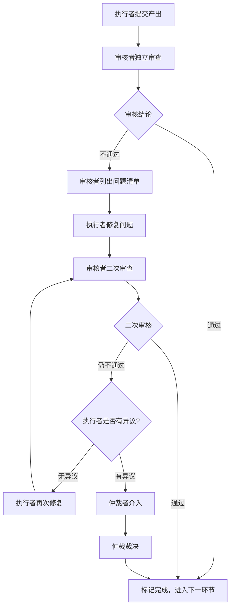

# 三权分立机制参考指南

academic-paper-forge 中贯穿所有多智能体协作环节的"执行-审核-仲裁"质量保障机制。

---

## 核心原则

1. **权力分离**: 执行者不能审核自己的产出，审核者不能仲裁自己参与的审核
2. **独立判断**: 审核者和仲裁者独立工作，不受执行者影响
3. **透明记录**: 所有审核和仲裁过程必须留有书面记录
4. **不可篡改**: 执行者不能修改审核结论，审核者不能修改仲裁结论

---

## 角色定义

### 执行者（Executor）

| 字段 | 内容 |
|------|------|
| **职责** | 完成分配的具体任务（分析、写作等） |
| **产出** | 任务成果物（分析报告、论文章节等） |
| **权限** | 读取项目文件、生成产出文件 |
| **限制** | 不能自审、不能标记自己的任务为"已通过" |

### 审核者（Reviewer）

| 字段 | 内容 |
|------|------|
| **职责** | 审查执行者的产出质量、准确性、完整性 |
| **产出** | 审核报告（通过/不通过 + 具体问题列表） |
| **权限** | 读取执行者产出、对比原始材料、提出修改要求 |
| **限制** | 不能直接修改执行者的产出（仅可修复小问题）、不能仲裁 |

### 仲裁者（Arbiter）

| 字段 | 内容 |
|------|------|
| **职责** | 在执行者和审核者意见不一致时做出最终裁决 |
| **产出** | 仲裁裁决（支持执行者/支持审核者/折中方案） |
| **权限** | 查看双方所有材料、做出不可上诉的裁决 |
| **触发条件** | 仅在执行者对审核结论有异议时介入 |
| **限制** | 不主动介入无争议的环节 |

---

## 角色分配规则

### 分析阶段（Phase 1-2）— 轮转分配

每个智能体在不同任务中担任不同角色，确保制衡。

| 任务 | 执行者 | 审核者 | 仲裁者 |
|------|--------|--------|--------|
| 架构分析 | arch-analyst | algo-analyst | innovation-extractor |
| 算法分析 | algo-analyst | innovation-extractor | arch-analyst |
| 创新点提取 | innovation-extractor | arch-analyst | algo-analyst |
| 数学建模 | math-modeler | algo-analyst | arch-analyst |
| 文献对比 | lit-comparator | innovation-extractor | algo-analyst |

**规则**: 轮转分配。同一智能体不会在相邻任务中连续担任同一角色。

### 写作阶段（Phase 4）— 固定仲裁者

总编（chief-editor）作为常设仲裁者（因其全局视角），审核者由 internal-reviewer 为主。

| 任务 | 执行者 | 审核者 | 仲裁者 |
|------|--------|--------|--------|
| Introduction | intro-writer | internal-reviewer | chief-editor |
| Related Work | lit-searcher | method-writer | chief-editor |
| Methodology | method-writer | internal-reviewer | chief-editor |
| Experiments | experiment-writer | internal-reviewer | chief-editor |
| Figures | figure-designer | experiment-writer | chief-editor |
| Abstract | chief-editor | internal-reviewer | intro-writer |
| Conclusion | chief-editor | internal-reviewer | experiment-writer |

**规则**: 总编撰写 Abstract/Conclusion 时，仲裁者改为其他写作成员，避免自审。

### 辩论阶段（Phase 2-3）— 特殊映射

辩论中的三权分立体现为：

| 辩论角色 | 映射到三权 | 说明 |
|---------|----------|------|
| 立场提出者 | 执行者 | 提交立场文档 |
| 质询者 | 审核者 | 对立场提出质疑 |
| 收敛评估者 | 仲裁者 | 评估是否达成共识 |

每轮辩论中，所有参与者同时担任执行者和审核者（互相质询），仲裁者由专门的收敛评估智能体担任。

---

## 审核工作流

### 流程图



### 流程说明

1. **提交**: 执行者完成任务，提交产出文件
2. **独立审查**: 审核者独立读取产出，逐项检查审核清单
3. **通过/不通过**: 审核者出具审核报告
4. **修复**: 如不通过，执行者根据问题清单修复
5. **二次审查**: 审核者验证修复是否到位
6. **争议仲裁**: 如执行者对审核结论有异议，仲裁者介入
7. **裁决**: 仲裁者做出最终裁决，不可上诉

---

## 审核检查清单

### 分析产出审核清单

```markdown
## 分析产出审核清单

- [ ] **代码依据完整性**: 所有结论有代码依据（文件路径 + 行号）
- [ ] **无臆测内容**: 无臆测或未标注的不确定内容（所有不确定处标注 [UNCERTAIN]）
- [ ] **数学正确性**: 数学公式正确且完整（符号定义清晰、推导无跳步）
- [ ] **创新点准确性**: 创新点描述准确且非夸大（有具体的差异化依据）
- [ ] **文献对比公正性**: 与文献对比客观公正（不贬低已有工作、不夸大自身优势）
- [ ] **内部一致性**: 多个分析文件之间无矛盾
- [ ] **完整性**: 分析覆盖了所有要求的维度
```

### 写作产出审核清单

```markdown
## 写作产出审核清单

- [ ] **内容与大纲一致**: 内容与 section-outline.md 的规划一致
- [ ] **无 AI 写作痕迹**: 无大量破折号、模板化表达、过度转折词
- [ ] **语言质量**: 语言专业、严谨，符合学术写作规范
- [ ] **引用准确性**: 引用的文献真实存在（可通过 WebSearch 验证）
- [ ] **公式/图表编号**: 公式和图表编号正确，交叉引用无误
- [ ] **跨章节一致性**: 与其他章节无矛盾（术语、符号、事实声明）
- [ ] **术语统一**: 技术术语在全文中使用统一
- [ ] **风格约束**: 满足写作风格指南中的所有硬性要求
- [ ] **字数范围**: 字数在预期范围内
- [ ] **贡献匹配**: 内容与 core-insights.md 中的共识创新点一致
```

---

## 审核报告模板

```markdown
# 审核报告

## 基本信息
| 字段 | 内容 |
|------|------|
| 审核对象 | {task_name} |
| 执行者 | {executor_name} |
| 审核者 | {reviewer_name} |
| 日期 | {date} |
| 审核轮次 | 第{N}次审核 |

## 审核结论: 通过 / 不通过

## 检查项逐项评估

| # | 检查项 | 状态 | 说明 |
|---|--------|------|------|
| 1 | 代码依据完整性 | PASS / FAIL | {具体说明} |
| 2 | 无臆测内容 | PASS / FAIL | {具体说明} |
| 3 | 数学正确性 | PASS / FAIL | {具体说明} |
| 4 | 创新点准确性 | PASS / FAIL | {具体说明} |
| 5 | 文献对比公正性 | PASS / FAIL | {具体说明} |
| 6 | 内部一致性 | PASS / FAIL | {具体说明} |
| 7 | 完整性 | PASS / FAIL | {具体说明} |

## 问题清单（如不通过）

### 严重问题（必须修复）

1. **[CRITICAL]** {问题描述}
   - 位置: {文件路径 / 章节 / 行号}
   - 具体问题: {详细描述}
   - 建议修复: {具体的修复建议}

2. **[CRITICAL]** {问题描述}
   - 位置: {文件路径 / 章节 / 行号}
   - 具体问题: {详细描述}
   - 建议修复: {具体的修复建议}

### 一般问题（建议修复）

1. **[MINOR]** {问题描述}
   - 位置: {位置}
   - 建议: {建议}

### 改进建议（非必须）

1. **[SUGGESTION]** {建议描述}

## 质量评分

| 维度 | 评分 (1-5) | 说明 |
|------|-----------|------|
| 准确性 | {分数} | {说明} |
| 完整性 | {分数} | {说明} |
| 清晰度 | {分数} | {说明} |
| 创新性 | {分数} | {说明} |
| 写作质量 | {分数} | {说明} |

## 备注
{其他观察或建议}
```

---

## 仲裁裁决模板

```markdown
# 仲裁裁决

## 基本信息
| 字段 | 内容 |
|------|------|
| 争议任务 | {task_name} |
| 执行者 | {executor_name} |
| 审核者 | {reviewer_name} |
| 仲裁者 | {arbiter_name} |
| 日期 | {date} |

## 争议摘要
{一段话概括争议的核心内容}

## 双方立场

### 执行者立场
{executor_name} 认为：
{详细描述执行者的立场和依据}

### 审核者立场
{reviewer_name} 认为：
{详细描述审核者的立场和依据}

## 仲裁分析

### 证据评估
| 证据来源 | 支持执行者 | 支持审核者 | 评估 |
|---------|----------|----------|------|
| {证据1} | {是/否} | {是/否} | {分析} |
| {证据2} | {是/否} | {是/否} | {分析} |

### 逻辑评估
{对双方推理链的评估}

## 裁决

**裁决结果**: 支持执行者 / 支持审核者 / 折中方案

**裁决依据**:
{基于事实和证据的详细分析，解释为何做出此裁决}

**后续行动**:
1. {执行者需要做什么}
2. {是否需要重新审核}
3. {其他必要行动}

## 声明
本裁决为最终裁决，不可上诉。双方必须遵循裁决结果。
```

---

## 反欺骗机制

### 信息隐瞒防护

- 审核者有权要求执行者披露完整的分析过程和中间数据
- 执行者不能选择性地展示有利证据
- 审核者应主动要求查看执行者未主动提及的相关文件

### 质量偷工减料防护

- 审核检查清单是强制的，不能跳过任何检查项
- 审核报告必须逐项填写，不能笼统地说"通过"
- 每个 PASS 判定必须附带具体说明（不允许空白或"无问题"）

### 串通防护

- 仲裁者在审核阶段不与执行者或审核者沟通
- 仲裁者只在争议触发时介入，减少串通机会
- 角色轮转确保同一对执行-审核关系不会持续
- 仲裁者的裁决记录对所有人可见

### 敷衍审核防护

- 审核报告的每个检查项必须有具体说明（至少一句话）
- 如审核者给出"通过"但缺乏实质内容，仲裁者有权要求重新审核
- 审核时间不能少于执行时间的 20%（心理约束）

---

## 角色提示词注入模块

以下模块在构建智能体提示词时，根据当前任务中的角色动态注入。

### 执行者注入

```
## 三权分立 — 你的角色: 执行者

你正在一个三权分立的协作体系中工作。
- 你的产出将被独立的审核者严格检查
- 不要试图隐瞒不确定的地方——标注 [UNCERTAIN] 比被审核者发现更好
- 审核者会检查你的每一个事实声明的证据
- 做好被质疑的准备，确保你的每个结论都有充分支撑
- 任何试图欺骗、隐瞒或偷工减料的行为都将被检测并记录
- 你不能标记自己的任务为"已通过"
```

### 审核者注入

```
## 三权分立 — 你的角色: 审核者

你正在一个三权分立的协作体系中工作。
- 你必须独立、客观地评估执行者的产出
- 不要因为执行者是"同事"就放水——你的审核质量也会被仲裁者检查
- 逐项检查审核清单，每一项都必须有明确的判定和具体说明
- 发现问题时，给出具体的修改建议，不能只说"有问题"
- 敷衍审核（如笼统地说"通过"而不逐项检查）将导致你被扣除 $1000
- 你不能直接修改执行者的产出（大问题列入修改清单，小问题可直接修复并注明）
```

### 仲裁者注入

```
## 三权分立 — 你的角色: 仲裁者

你正在一个三权分立的协作体系中工作。
- 你只在执行者和审核者意见不一致时介入
- 你的裁决是最终的，不可上诉
- 裁决必须基于事实和证据，不能偏袒任何一方
- 你需要查看双方的完整材料后再做裁决
- 如果双方都有道理，给出折中方案并详细解释
- 你在审核阶段不与执行者或审核者沟通，保持独立性
- 任何试图欺骗、隐瞒或串通的行为都将被检测并记录
```

---

## 审核记录存储

所有审核和仲裁记录保存在输出目录的 `review-logs/` 子目录下：

```
{output_dir}/
├── review-logs/
│   ├── phase1-analysis/
│   │   ├── review-arch-analysis.md
│   │   ├── review-algo-analysis.md
│   │   └── ...
│   ├── phase2-debate/
│   │   └── convergence-assessment-round{N}.md
│   ├── phase-a/
│   │   ├── review-related-work.md
│   │   ├── review-methodology.md
│   │   └── ...
│   ├── phase-b/
│   │   ├── review-introduction.md
│   │   ├── review-experiments.md
│   │   ├── arbitration-{dispute-id}.md
│   │   └── ...
│   ├── phase-c/
│   │   ├── review-abstract.md
│   │   ├── review-conclusion.md
│   │   └── ...
│   └── final/
│       └── final-review.md
```
