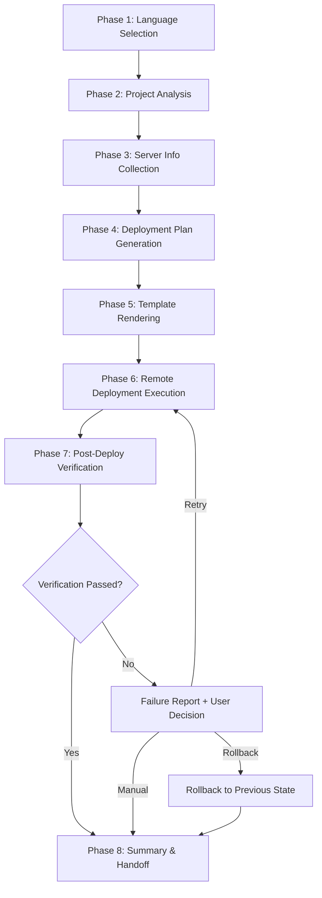
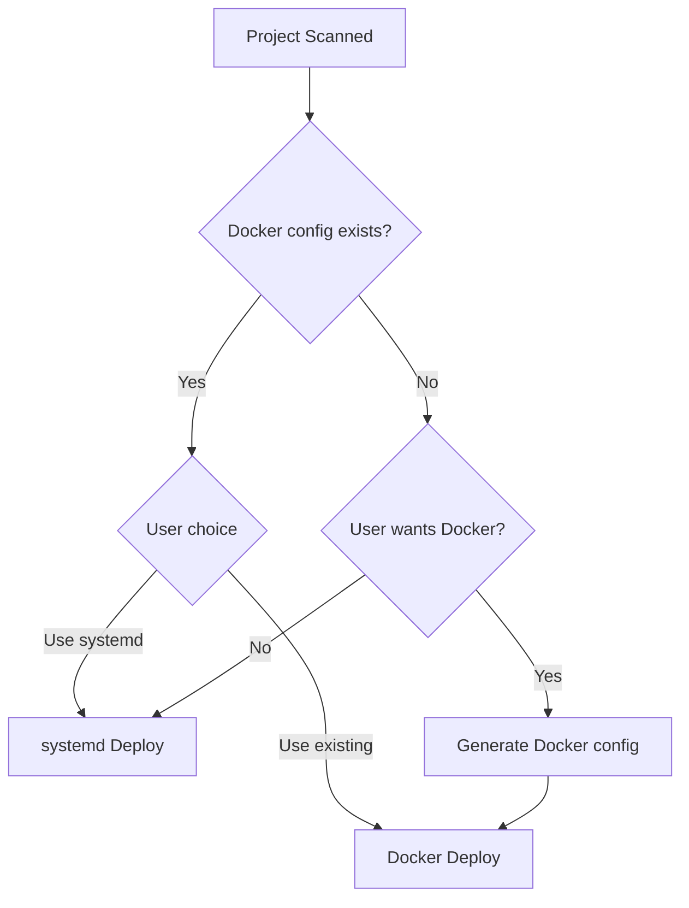

# Master Plan: web-deployer Skill

## Overview

Create a generic **web-deployer** Claude Code skill that transforms the existing InkClaw-specific ops deployment scripts into a universal, template-driven deployment toolkit. The skill enables one-command deployment of any web project (frontend+backend separated or monolith) to any Linux server, supporting both systemd and Docker service management, Nginx reverse proxy, multi-server batch deployment, and two automation modes (interactive guided + full-auto).

## Goals

1. **Generalize** the existing InkClaw ops scripts into parameterized templates
2. **Auto-detect** project type from the current working directory (Next.js, React, Vue, Flask, Django, Express, etc.)
3. **Deploy** via SSH using the `ssh-remote` skill pattern (paramiko)
4. **Leave behind** a fully independent `ops/` toolkit on both local and server — usable without the skill
5. **Verify** deployment success via tiered health checks (quick / full)
6. **Support** systemd bare-metal and Docker container deployment modes
7. **Support** Nginx reverse proxy with SSL/SSE auto-configuration
8. **Support** multi-server batch deployment in a single skill run

## Scope

### In Scope

| Area | Details |
|------|---------|
| Project types | Frontend+backend separated (React+Flask, Vue+Django, Next.js+Express, etc.) and monolith (pure Flask, pure Next.js, pure Django, etc.) |
| Deployment modes | systemd services, Docker (Dockerfile + docker-compose) |
| Service management | install, uninstall, status, logs, healthcheck, watchdog |
| Reverse proxy | Nginx templates (HTTP / HTTPS+SSL), SSE/WebSocket support |
| Multi-server | Batch deploy to N servers with per-server config |
| Automation | Interactive guided mode + full-auto mode |
| Verification | Tiered: quick (HTTP health) and full (health + Nginx + SSL + logs + resources) |
| Failure handling | Detailed failure report + user decision (retry / rollback / manual fix) |
| Artifacts | ops/ folder with independent scripts + config.env on both local and server |
| Language | SKILL.md in English; runtime interaction language chosen by user at startup |

### Out of Scope

- CI/CD pipeline integration (GitHub Actions, GitLab CI, etc.)
- Database provisioning or migration
- DNS configuration
- SSL certificate acquisition (certbot) — skill detects existing certs, doesn't create them
- Container orchestration (Kubernetes, Swarm)
- Windows server deployment
- Non-web services (cron jobs, message queues) as primary targets

## Architecture

### Skill File Structure

```
web-deployer/
├── SKILL.md                    # Main workflow definition (English)
├── README.md                   # User-facing documentation
├── _meta.json                  # Version, tags, metadata
└── templates/
    ├── ops/
    │   ├── config.env.tpl      # Configuration template
    │   ├── install.sh.tpl      # systemd service installer template
    │   ├── install-deps.sh.tpl # Dependency installer template
    │   ├── uninstall.sh.tpl    # Service uninstaller template
    │   ├── status.sh.tpl       # Status checker template
    │   ├── logs.sh.tpl         # Log viewer template
    │   ├── healthcheck.sh.tpl  # Watchdog health check template
    │   └── deploy.sh.tpl       # One-command deploy script template
    ├── systemd/
    │   ├── backend.service.tpl
    │   ├── frontend.service.tpl
    │   ├── watchdog.service.tpl
    │   ├── watchdog.timer.tpl
    │   └── logrotate.tpl
    ├── nginx/
    │   ├── site-https.tpl      # Includes SSE/WebSocket settings inline
    │   └── site-http.tpl       # Includes SSE/WebSocket settings inline
    └── docker/
        ├── Dockerfile.node.tpl
        ├── Dockerfile.python.tpl
        ├── Dockerfile.fullstack.tpl
        └── docker-compose.tpl
```

### Workflow Phases



### Project Detection Strategy

The skill scans the current working directory for markers:

| Marker | Detected As |
|--------|------------|
| `package.json` + `next.config.*` | Next.js frontend |
| `package.json` + `vue.config.*` or `vite.config.*` (Vue) | Vue frontend |
| `package.json` + `src/App.*` (React) | React frontend |
| `requirements.txt` + `app.py` or `wsgi.py` | Flask backend |
| `requirements.txt` + `manage.py` | Django backend |
| `package.json` + `server.*` or `index.*` (Express) | Express/Node backend |
| `Dockerfile` or `docker-compose.yml` | Docker-ready project |
| Combined markers | Frontend + Backend separated project |

### Deployment Mode Decision



### Template Variable System

All templates use `{{VARIABLE}}` placeholder syntax (consistent with existing ops scripts). Variables are resolved from:

1. **Auto-detected** from project analysis (PROJECT_DIR, PROJECT_NAME, etc.)
2. **User-provided** via interactive prompts (SERVER_HOST, DOMAIN, etc.)
3. **Defaults** with sensible values (BACKEND_PORT=5000, FRONTEND_PORT=3000, etc.)

### Multi-Server Architecture

```
┌─────────────────────────────────────────┐
│           SKILL Orchestrator             │
│  (local machine, manages deployments)    │
├─────────┬──────────┬──────────┬─────────┤
│ Server1 │ Server2  │ Server3  │ ServerN │
│ (SSH)   │ (SSH)    │ (SSH)    │ (SSH)   │
│ ops/    │ ops/     │ ops/     │ ops/    │
└─────────┴──────────┴──────────┴─────────┘
```

Each server gets its own `ops/` directory with server-specific `config.env`.

## Design Decisions

1. **Template-based, not code-generation**: Use `{{VAR}}` substitution in shell templates rather than generating scripts from scratch — more predictable, auditable, and consistent with existing ops patterns
2. **SSH via paramiko**: Reuse the `ssh-remote` skill pattern for remote operations — cross-platform, no external SSH client dependency
3. **ops/ as first-class artifact**: The generated ops scripts are the primary deployment artifact, not throwaway scaffolding
4. **Detection over configuration**: Auto-detect as much as possible, confirm with user, minimize manual config
5. **Fail-safe deployment**: Always backup before changes, detailed failure reports, user controls rollback
6. **SKILL writes templates, not hardcoded scripts**: The SKILL contains `.tpl` template files that get rendered with project-specific values

## Dependencies

- **ssh-remote** skill pattern (paramiko for SSH/SFTP)
- Target server: Linux with systemd (Ubuntu 20.04+ / Debian 11+ / CentOS 8+)
- Target server: Python 3.8+, Node.js 18+ (or Docker)
- Target server: Nginx (optional, for reverse proxy)

## Risks

| Risk | Mitigation |
|------|------------|
| Project type detection fails | Fall back to user-provided project structure info |
| SSH connection issues | Pre-flight connectivity check before deployment |
| Port conflicts on server | Port availability check + user notification |
| Existing services conflict | Detect and warn about existing systemd units with same name |
| Template rendering errors | Validate all required variables before rendering |
| Docker not installed on server | Detect + offer to install or fall back to systemd |

## Spec Files

| # | Spec | Content |
|---|------|---------|
| 01 | Project Analysis Engine | Project type detection, structure scanning, config inference |
| 02 | Template System | Template file format, variable resolution, rendering engine |
| 03 | Server Connection & Management | SSH connection, multi-server orchestration, pre-flight checks |
| 04 | systemd Deployment Pipeline | Service registration, watchdog, logrotate, start/stop lifecycle |
| 05 | Docker Deployment Pipeline | Dockerfile generation, compose orchestration, container management |
| 06 | Nginx Configuration | Reverse proxy templates, SSL detection, SSE/WebSocket support |
| 07 | Verification & Rollback | Tiered health checks, failure reporting, rollback mechanism |
| 08 | Ops Toolkit Generation | Independent scripts generation, naming conventions, local+remote placement |
| 09 | SKILL Workflow & User Interaction | Phase flow, guided/auto modes, language selection, AskUserQuestion design |
