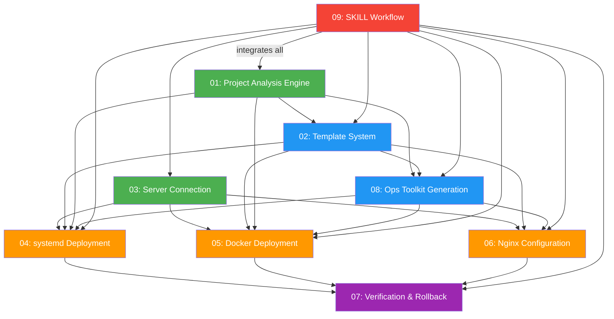

# Task Orchestration: web-deployer Skill

## 1. Dependency Graph



**Legend:** Green = Phase 1 (no deps), Blue = Phase 2, Orange = Phase 3, Purple = Phase 4, Red = Phase 5

## 2. Execution Phases

### Phase 1: Foundations (No Dependencies)

| Task | Agent | Description |
|------|-------|-------------|
| 01 | dev-01 | Project Analysis Engine — detection logic, ProjectProfile definition |
| 03 | dev-02 | Server Connection — SSH helpers, server info collection, pre-flight checks |

**Max concurrency:** 2 agents
**Gate:** Both must complete before Phase 2

### Phase 2: Template & Ops Infrastructure

| Task | Agent | Description |
|------|-------|-------------|
| 02 | dev-03 | Template System — all .tpl template files, variable registry, rendering rules |
| 08 | dev-04 | Ops Toolkit Generation — generalized ops scripts, README generation |

**Max concurrency:** 2 agents
**Depends on:** Phase 1 (01 for ProjectProfile definitions, 03 for SSH patterns)
**Gate:** Both must complete before Phase 3

### Phase 3: Deployment Pipelines

| Task | Agent | Description |
|------|-------|-------------|
| 04 | dev-05 | systemd Deployment — service registration, watchdog, logrotate |
| 05 | dev-05 | Docker Deployment — Dockerfile generation, compose orchestration |
| 06 | dev-06 | Nginx Configuration — reverse proxy, SSL, SSE support |

**Max concurrency:** 2 agents (dev-05 handles both 04+05, dev-06 handles 06)
**Depends on:** Phase 2 (02 for templates, 08 for ops scripts)
**Gate:** All must complete before Phase 4

### Phase 4: Verification

| Task | Agent | Description |
|------|-------|-------------|
| 07 | dev-07 | Verification & Rollback — health checks, backup, rollback logic |

**Max concurrency:** 1 agent
**Depends on:** Phase 3 (04, 05, 06 define what to verify)
**Gate:** Must complete before Phase 5

### Phase 5: Integration

| Task | Agent | Description |
|------|-------|-------------|
| 09 | dev-08 | SKILL Workflow — SKILL.md assembly, phase flow, modes, README, _meta.json |

**Max concurrency:** 1 agent
**Depends on:** ALL previous phases (integrates everything into SKILL.md)

## 3. Critical Path

```
01 (Project Analysis) → 02 (Templates) → 04/05 (Deployment) → 07 (Verification) → 09 (SKILL Workflow)
```

**Bottleneck tasks:**
- **02 (Template System)**: Has the most output files (20+ templates). Largest single workload.
- **09 (SKILL Workflow)**: Must integrate all modules. Cannot start until everything else is done.

## 4. Agent Assignments

**Total agents: 8 dev + reviewers + testers + inspector**

| Agent | Tasks | Rationale |
|-------|-------|-----------|
| dev-01 | 01 (Project Analysis) | Standalone detection logic |
| dev-02 | 03 (Server Connection) | Standalone SSH/connection logic |
| dev-03 | 02 (Template System) | Largest workload — all template files |
| dev-04 | 08 (Ops Toolkit) | Script generalization from existing InkClaw ops |
| dev-05 | 04 + 05 (systemd + Docker) | Related deployment pipelines, same agent for consistency |
| dev-06 | 06 (Nginx) | Focused scope, Nginx expertise |
| dev-07 | 07 (Verification) | Testing/verification logic |
| dev-08 | 09 (SKILL Workflow) | Final integration — reads all other outputs |

**Coordination notes:**
- dev-03 and dev-04 must coordinate on template variable names (both define and consume variables)
- dev-05 must read dev-04's generated ops scripts to ensure deployment pipeline calls them correctly
- dev-08 must read ALL other agents' outputs to assemble the final SKILL.md

## 5. Context Files (Required Reading per Agent)

### All Agents Must Read

- `docs/plans/web-deployer-skill/master-plan.md`
- `docs/plans/web-deployer-skill/task-orchestration.md`
- Existing InkClaw ops scripts: `web-deployer/ops/*.sh`, `web-deployer/ops/templates/*`, `web-deployer/ops/config.env`
- Repository CLAUDE.md (for skill structure conventions)

### Per-Agent Additional Reading

| Agent | Additional Files |
|-------|-----------------|
| dev-01 | `specs/01-project-analysis-engine.md`, `todos/01-project-analysis-engine.md` |
| dev-02 | `specs/03-server-connection.md`, `todos/03-server-connection.md`, `planning-with-discovery/SKILL.md` (Remote Server Protocol section for SSH patterns) |
| dev-03 | `specs/02-template-system.md`, `todos/02-template-system.md`, ALL existing ops templates |
| dev-04 | `specs/08-ops-toolkit-generation.md`, `todos/08-ops-toolkit-generation.md`, ALL existing ops scripts |
| dev-05 | `specs/04-systemd-deployment.md`, `specs/05-docker-deployment.md`, `todos/04-*.md`, `todos/05-*.md` |
| dev-06 | `specs/06-nginx-configuration.md`, `todos/06-nginx-configuration.md`, existing Nginx templates |
| dev-07 | `specs/07-verification-rollback.md`, `todos/07-verification-rollback.md` |
| dev-08 | ALL specs, ALL todos, ALL outputs from dev-01 through dev-07, existing skill SKILL.md files (for format reference) |

### Reference Skills (for format)

- `planning-with-discovery/SKILL.md` — reference for SKILL.md format, AskUserQuestion patterns, phase structure
- `ssh-remote/SKILL.md` — reference for SSH/paramiko patterns
- `project-indexer/SKILL.md` — reference for project scanning patterns
- `bug-diagnosis/SKILL.md` — reference for dual-mode (semi-auto/full-auto) pattern

## 6. Output File Mapping

| Agent | Creates/Modifies |
|-------|-----------------|
| dev-01 | Contributes to SKILL.md Phase 2 (project analysis) |
| dev-02 | Contributes to SKILL.md Phase 3 (server connection), SSH helper functions |
| dev-03 | `web-deployer/templates/ops/*.tpl`, `templates/systemd/*.tpl`, `templates/nginx/*.tpl`, `templates/docker/*.tpl` |
| dev-04 | Generalized script content (feeds into templates) |
| dev-05 | Contributes to SKILL.md Phase 6 (deployment execution) |
| dev-06 | Contributes to SKILL.md Phase 6 (Nginx configuration) |
| dev-07 | Contributes to SKILL.md Phase 7 (verification) |
| dev-08 | `web-deployer/SKILL.md`, `web-deployer/README.md`, `web-deployer/_meta.json` — final assembly |
